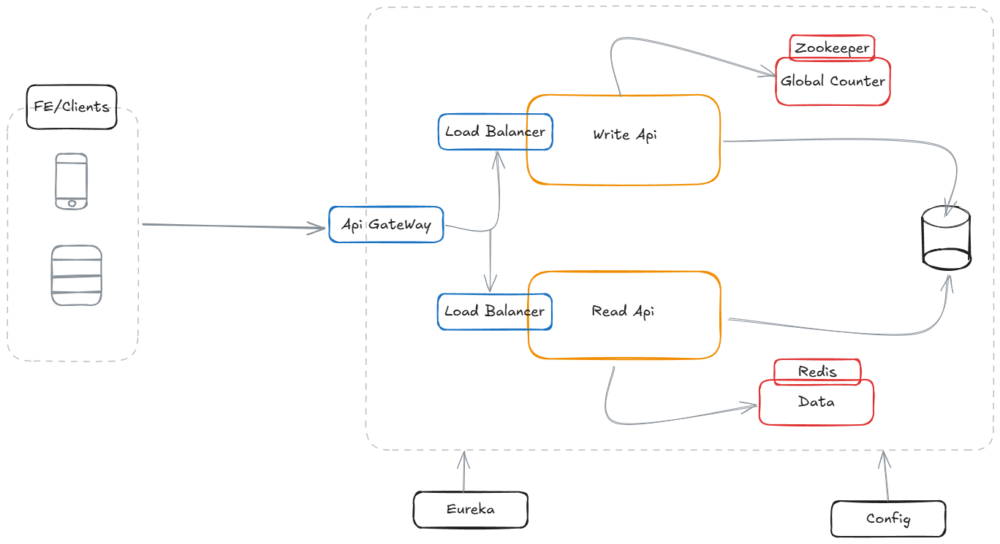

# 🔗 Shorten-BackEnd: Microservicio Acortador de URLs 🚀

Este proyecto implementa un backend para un servicio acortador de URLs utilizando una arquitectura de microservicios con Spring Boot y Spring Cloud.



## 📑 Índice

* [🚀 Resumen General](#1--resumen-general)
* [🛠️ Tecnologías Utilizadas](#2-%EF%B8%8F-tecnologías-utilizadas)
* [🏛️ Arquitectura de Microservicios](#3-%EF%B8%8F-arquitectura-de-microservicios)
* [➡️ Flujo de Datos Típico](#4-%EF%B8%8F-flujo-de-datos-típico)
* [🧩 Componentes Detallados](#5--componentes-detallados)
    * [🐳 docker-compose.yml](#51--docker-composeyml)
    * [⚙️ configuration (Config Server)](#52-%EF%B8%8F-configuration-config-server)
    * [🗺️ eureka-api (Eureka Server)](#53-%EF%B8%8F-eureka-api-eureka-server)
    * [🚪 gateway-api (API Gateway)](#54--gateway-api-api-gateway)
    * [✍️ write-api](#55-%EF%B8%8F-write-api)
    * [📖 read-api](#56--read-api)
    * [💾 db (MySQL)](#57--db-mysql)
    * [⚡ cache (Redis)](#58--cache-redis)
    * [📄 mysql-init/schema.sql](#59--mysql-initschemasql)
* [🔧 Configuración y Ejecución](#6--configuración-y-ejecución)
* [🧪 Pruebas con Postman](#7--pruebas-con-postman)

---

## 1. 🚀 Resumen General

`Shorten-BackEnd` es un sistema de microservicios diseñado para actuar como un acortador de URLs. Permite a los usuarios enviar una URL larga y recibir una URL corta única 🔗. Posteriormente, al acceder a la URL corta, el sistema devuelve la URL original.

---

## 2. 🛠️ Tecnologías Utilizadas

* ☕ **Lenguaje**: Java 21
* 🌱 **Frameworks**:
    * Spring Boot 3.4.4
    * Spring Cloud 2024.0.1 (Config Server, Eureka, Gateway)
    * Spring Data JPA
    * Spring Data Redis
    * Spring Boot Actuator
* 💾 **Base de Datos**: MySQL 8.0
* ⚡ **Caché / Limitación de Tasa**: Redis
* 🐳 **Contenerización**: Docker, Docker Compose
* 🏗️ **Construcción**: Apache Maven
* 📝 **Otros**: Lombok

---

## 3. 🏛️ Arquitectura de Microservicios

El sistema sigue una arquitectura de microservicios, separando las responsabilidades en componentes independientes:

1. **Config Server (`⚙️ configuration`)**: Configuración centralizada.
2. **Eureka Server (`🗺️ eureka-api`)**: Descubrimiento de servicios.
3. **API Gateway (`🚪 gateway-api`)**: Punto de entrada, limitación de tasa y CORS.
4. **Write API (`✍️ write-api`)**: Crea nuevas URLs cortas.
5. **Read API (`📖 read-api`)**: Resuelve URLs cortas.
6. **Database (`💾 db`)**: Contenedor MySQL.
7. **Cache (`⚡ cache`)**: Contenedor Redis para caché y rate limiting.

---

## 4. ➡️ Flujo de Datos Típico

* **Acortar una URL: ✍️**
    1. 👤 Cliente envía `POST` a `🚪 gateway-api` (`/write/shorten` con `longUrl`).
    2. Se enruta a `✍️ write-api`.
    3. `✍️ write-api` genera un `shortId`, lo guarda en MySQL.
    4. Devuelve `shortId`.

* **Resolver una URL corta: 📖**
    1. 👤 Cliente hace `GET /read/{shortId}`.
    2. El Gateway enruta a `📖 read-api`.
    3. Redis se consulta primero.
    4. Si no está en caché, se consulta MySQL.
    5. Si se encuentra, se guarda en Redis y se devuelve.
    6. Si no existe, se responde con 404.

---

## 5. 🧩 Componentes Detallados

### 5.1. 🐳 `docker-compose.yml`

* Orquesta todos los servicios en la red `shorten-net`.
* Usa `depends_on`, `healthcheck` y `.env`.
* Expone el puerto `8083`.

### 5.2. ⚙️ `configuration` (Config Server)

* **Puerto**: 8888
* Sirve configuraciones desde `src/main/resources/configurations/`.

### 5.3. 🗺️ `eureka-api` (Eureka Server)

* **Puerto**: 8080
* No se registra a sí mismo.

### 5.4. 🚪 `gateway-api` (API Gateway)

* **Puerto**: 8083
* Enruta `/read/**` y `/write/**`
* Rate Limiting basado en IP (Redis).
* Configura CORS.

### 5.5. ✍️ `write-api`

* **Puerto**: 8082
* `POST /write/shorten`
* Genera IDs Base62 (5 caracteres), valida y guarda.
* Manejo global de excepciones.

### 5.6. 📖 `read-api`

* **Puerto**: 8081
* `GET /read/{shortId}`
* Usa caché Redis con `@Cacheable`.
* Manejo global de excepciones.

### 5.7. 💾 `db` (MySQL)

* **Imagen**: `mysql:8.0`
* Contiene tabla `url` en la base `shortener`.
* Inicializa con:

  CREATE TABLE url (
  short_id VARCHAR(10) PRIMARY KEY,
  long_url TEXT NOT NULL,
  created_date DATE NOT NULL
  );

### 5.8. ⚡ `cache` (Redis)

* **Imagen**: `redis:7.4.2`
* Usado por `read-api` y `gateway-api`.

### 5.9. 📄 `mysql-init/schema.sql`

* Script SQL de inicialización:

  CREATE TABLE url (
  short_id VARCHAR(10) PRIMARY KEY,
  long_url TEXT NOT NULL,
  created_date DATE NOT NULL
  );

---

## 6. 🔧 Configuración y Ejecución

### 1. ✅ Prerrequisitos

* Docker & Docker Compose
* JDK 21
* Apache Maven
* Git

### 2. 📥 Clonar el Repositorio

    git clone <url-del-repositorio>
    cd Shorten-BackEnd

### 3. 🔑 Archivo `.env`

Crear `.env` en la raíz:

    MYSQL_USER=tu_usuario
    MYSQL_PASSWORD=tu_contraseña_segura

### 4. 🚀 Construcción y Ejecución

Desde raíz:

    docker-compose up --build -d

### 5. 🌐 Acceso

* API Gateway en: `http://localhost:8083`

### 6. 🛑 Detener los Servicios

    docker-compose down

Opcional para eliminar datos:

    docker-compose down -v

---

## 7. 🧪 Pruebas con Postman

### 📬 Acortar una URL

**Método**: `POST`  
**URL**: `http://localhost:8083/write/shorten?longUrl=https://www.ejemplo.com/una/url/larga`

**Respuesta esperada**:

```json
{
    "shortId": "aBcDe"
}
```

---

### 🔍 Resolver una URL corta

**Método**: `GET`  
**URL**: `http://localhost:8083/read/aBcDe`

**Respuesta esperada**:

```json
{
    "longUrl": "https://www.ejemplo.com/una/url/larga"
}
```

---

